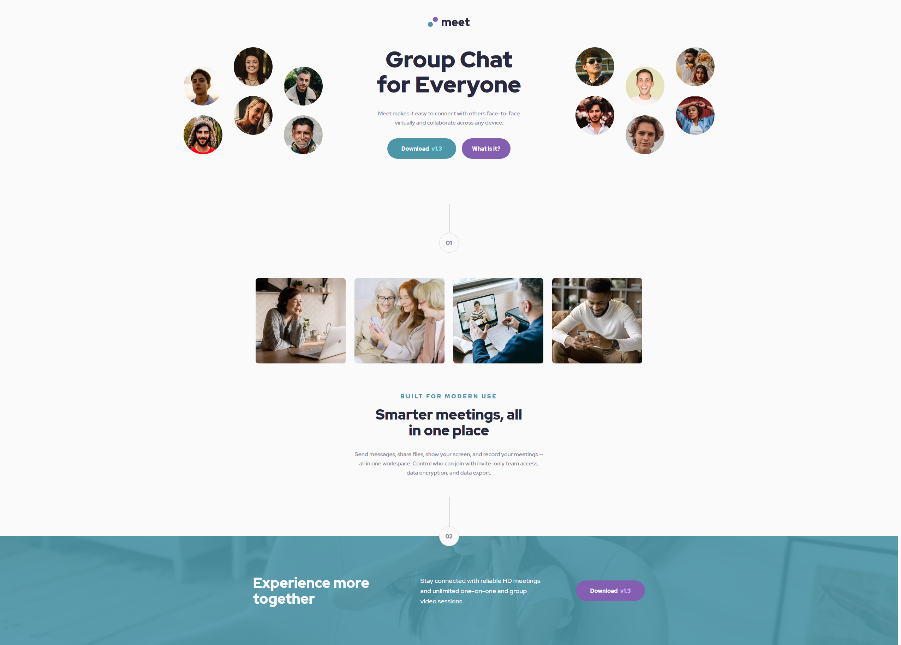
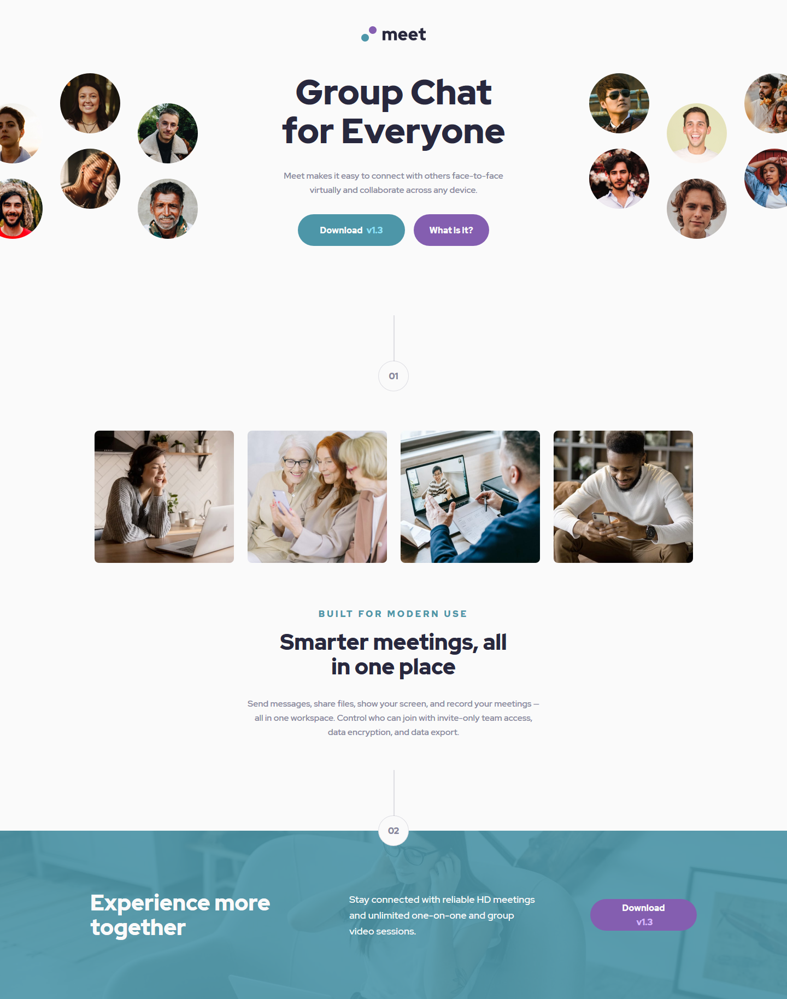
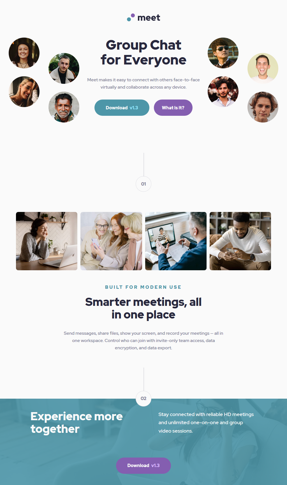

# Frontend Mentor - Meet landing page solution

This is a solution to the [Meet landing page challenge on Frontend Mentor](https://www.frontendmentor.io/challenges/meet-landing-page-rbTDS6OUR). Frontend Mentor challenges help you improve your coding skills by building realistic projects.

## Table of contents

- [Overview](#overview)
  - [The challenge](#the-challenge)
  - [Screenshot](#screenshot)
  - [Links](#links)
- [My process](#my-process)
  - [Built with](#built-with)
  - [What I learned](#what-i-learned)
    - [CSS custom properties](#CSS-custom-properties)
    - [Absolute IMG Positioning](#Absolute-IMG-Positioning)
  - [Continued development](#continued-development)
- [Author](#author)

## Overview

### The challenge

Users should be able to:

- View the optimal layout depending on their device's screen size
- See hover states for interactive elements

### Screenshot

- Desktop Layout - shown on 2560px screen



- Desktop Layout - shown on 1440px screen



- tablet Layout - vertical


- tablet Layout - horizontal



- mobile Layout


### Links

- Solution URL: [Frontend Mentor Submission](https://your-solution-url.com)
- Live Site URL: [Github Pages.io](https://mainlycolors.github.io/meet-landing-page/)

## My process

### Built with

- Semantic HTML5 markup
- CSS custom properties
- CSS calc functions
- Flexbox
- Mobile-first workflow

### What I learned

## CSS custom properties

- I was using CSS custom properties before this project but only for things like color and font-family's. during this projects I played more with the idea of using them to set max widths on element limits when a clamp from the mobile to desktop design was too much.

- For the design the h1 needs a font-size of:

  - Mobile layout: 24px
  - Tablet layout: 48px
  - Desktop layout: 64px

- Where my layouts are defined as:

  - Mobile layout width: 375px
  - Tablet layout width: 768px
  - Desktop layout width: 1440px

- To achieve this I first wrote `font-size: clamp(1.5em, 10.7vw, 64px)` but this is hard to balance for 3 separate designs and the in-between of each of those. so to fix this we use a CSS custom property to define the max value of the clamp to be 48px then redefine it through a media query for the desktop layout.

- By doing this we still take advantage of a clamp supporting responsive font sizing between the layouts and at the smallest and largest layout.

```css
:root {
  --font-h1-max-size: 3em;
}

h1 {
  font-size: clamp(1.5em, 10.7vw, var(--font-h1-max-size));
  line-height: 1.1em;
}

@media only screen and (min-width: 1140px) {
  :root {
    --font-h1-max-size: 4em;
  }
}
```

## Absolute IMG Positioning

- The biggest challenge in this design was the header hero `` was in 2 halves because in the mobile/tablet view, they had to come together to form a banner and in the desktop view have to split to allow text between the ``'s.

- Mobile Layout
  

- Desktop Layout
  

- I tried many different approaches on this and over complicated it a ton. when I first started, I tried to implement the `` without using absolute positioning because I never considered it. My first attempt looked like this.

# Attempt 1 ❌❌❌

HTML

```html
<section class="landing-page">
  
  
  <div class="landing-Page__title">
    <h1>Group Chat for Everyone</h1>
    <p>Meet makes it easy to connect with others face-to-face virtually and collaborate across any device.</p>
    <button class="btn btn--download">Download v1.3</button>
    <button class="btn btn--question">What is it?</button>
  </div>
</section>
```

CSS

```css
.landing-page {
  overflow-x: hidden;
}

.landing-page img {
  height: auto;
  width: 199px;
  margin-bottom: 48px;
}

.landing-page img:first-of-type {
  margin-left: -20px;
  margin-right: 8px;
}

.landing-page img:last-of-type {
  margin-right: -28px;
  margin-left: 8px;
}
```

- I think this worked but it was very hardcoded for the mobile layout and the next question was how do I separate the images as the screen gets larger.

- After some research I learned position: absolute might be the fix I need but the issue with absolute elements is they are taken out of the document/website flow so they will end up on top of normal default positioned static elements. To fix this people house the absolute element within a static container so the width and height can still be controlled and will still effect the elements around it.

# Attempt 2 ❌❌❌

HTML - added img container

```html
<section class="landing-page">
  <div class="landing-page__img-container">
    
    
  </div>
  <div class="landing-Page__title">
    <h1>Group Chat for Everyone</h1>
    <p>Meet makes it easy to connect with others face-to-face virtually and collaborate across any device.</p>
    <button class="btn btn--download">Download v1.3</button>
    <button class="btn btn--question">What is it?</button>
  </div>
</section>
```

CSS

```css
.landing-page {
  overflow-x: hidden;
}

.landing-page__img-container {
  margin-bottom: clamp(48px, 9.4vw, 72px);
  position: relative;
  width: 100%;
  height: clamp(114px, 40.8vw, 311px);
}

.landing-page img {
  height: auto;
  width: clamp(140px, 53vw, 394px);
}

.landing-page img:first-of-type {
  position: absolute;
  top: 0;
  left: -20px;
}

.landing-page img:last-of-type {
  position: absolute;
  top: 0;
  right: -20px;
}
```

- In this attempt the margins are removed from the ``'s because the margin was used to push the landing page text down but since absolute elements are removed from the document flow, this no longer works. Instead we create an `` container and apply all our size/position constraints on there. With this attempt the ``'s are more responsive with sizing based on view-width units and clamps. And with this attempt, as the screen gets wider the ``'s will forever separate.

- To handle the desktop layout where text comes up to get sandwiched by 2 ``'s, I used a media query to remove the height on the `` container.

```css
@media only screen and (min-width: 1140px) {
  .landing-page__img-container {
    margin: unset;
    height: unset;
  }
}
```

- After this I thought I was done and solved the issue but a new issue arose, between the tablet and desktop screen widths there wasn't enough space for the text to fit up next to the ``'s but there was too much whitespace between them so it looked bad. Had to try again.

# Attempt 3 ❌❌❌

```css
@media only screen and (min-width: 800px) and (max-width: 1140px) {
  .landing-page img:first-of-type {
    /* left: clamp(-220px, 27.5vw * -1, -70px); */
    /* left: clamp(-70px, 27.5vw * -1, -220px); */
    left: unset;
    right: calc(100vw - 394px + clamp(70px, 6.36vw, 220px));

    /*left: -200px;*/ /* 800px = -200, 900px = -180, 1000px =  -130, 1140px = 70 */
  }

  .landing-page img:last-of-type {
    /* right: clamp(-220px, 27.5vw * -1, -70px); */
    right: unset;
    left: calc(100vw - 394px + clamp(70px, 6.36vw, 220px));
  }
}
```

- So this is where I really started overcomplicating it, I was trying to move the ``'s away from the text outside the body so instead of (6) faces shown, it would show (2) then (4) then (6) on either side as the screen width grew larger and after 1140px width, the next media query takes over because it works there. But this was not working at all for me and I was getting no where so I took a break on it.

# Attempt 4 ✔✔✔

HTML

```html
<section class="landing-page">
  <div class="landing-page__img-container">
    <div class="landing-page__hero-left">
      
    </div>
    <div class="landing-page__hero-right">
      
    </div>
  </div>
</section>
```

CSS

```css
@media only screen and (min-width: 800px) and (max-width: 1140px) {
  .landing-page__img-container {
    margin: unset;
    height: unset;
  }

  .landing-page__hero-left {
    margin-right: 14.3125rem;
  }

  .landing-page__hero-right {
    margin-left: 14.3125rem;
  }

  .landing-page__hero-left img {
    left: unset;
    right: 0;
  }

  .landing-page__hero-right img {
    right: unset;
    left: 0;
  }
}
```

- I realized I need to stop trying so hard and let the browser take care of it for me. So I added (2) new `` containers to the already existing container to act as base points for the left and right hero img. then at sizes where the text needs to come between, I anchor the hero ``'s towards the center with the left hero set to `right: 0;` and the right hero set to `left: 0;`

- The `margin-right: 14.3125rem;` was to make room for text to be there.

### Continued development

- In the future I want to focus on moving forward with the first solution I come up with, I have a bad habit of trying to force some way to work thinking I don't want to take the easy way out but it severely holds up progress that could be made.

## Author

- Frontend Mentor - [@ryan2505](https://www.frontendmentor.io/profile/yourusername)
- Twitter - [@MainlyColors](https://www.twitter.com/mainlycolors)
